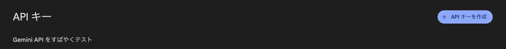
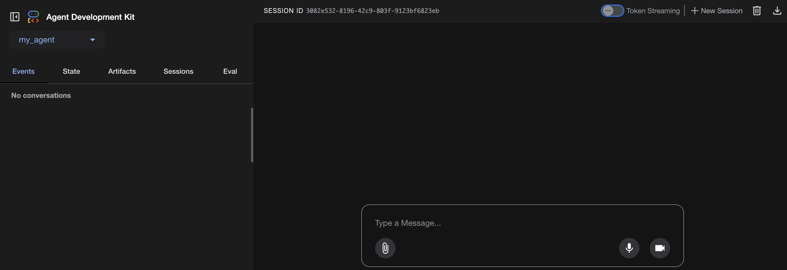
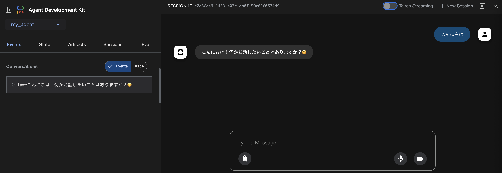
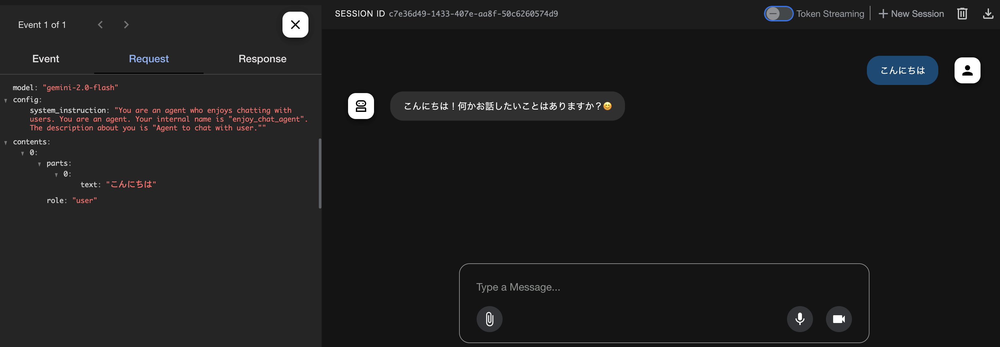

# Agent Development Kit で AI エージェントを作ってみよう

講師 : あんざいゆき ( https://x.com/yanzm )

普段は Android アプリを開発するお仕事をしています。

## AIエージェントとは

生成AIモデルの機能を拡張したプログラムで、あるゴールを達成するために自律的に環境を認識し、推論し、行動することができます。人間の介入なしに自律的に動くというのがポイントです。

おすすめ本: LLMのプロンプトエンジニアリング ( https://www.oreilly.co.jp/books/9784814401130/ )

## Agent Development Kit 

ADK 公式ドキュメント : https://google.github.io/adk-docs/

ADK は Google が提供しているAIエージェント開発のためのオープンソースのフレームワークです。
Gemini （Google が開発している LLM）と Cloud Run や Vertex AI などの Google エコシステムに最適化されていますが、モデルやデプロイメントに依存せず、他のフレームワークとの互換性も考慮して構築されています。ADK はエージェント開発をソフトウェア開発に近い感覚で行えるように設計されており、開発者が単純なタスクから複雑なワークフローまで、エージェントアーキテクチャを簡単に作成、デプロイ、オーケストレーションできるようになります。


現状 Python 版 と Java 版 があります。

- Python ADK : https://github.com/google/adk-python/
- Java ADK : https://github.com/google/adk-java/

Python ADK はすでに production-ready な安定版（v1.0.0 以降）がリリースされていますが、Java 版はまだ v0.3.0 です。

このハンズオンでは安定版がリリースされている Python ADK を使います。


## 環境設定

### エディタ

コードを編集するエディタやIDEが何も入っていないという人は Visual Studio Code (https://code.visualstudio.com/) をインストールしてください。

### Python

<span style="color:salmon"><b>Python を使います。Python がインストールされていない、インストールされているかどうかわからない、Python なにそれ？な人は手をあげて教えてください！</b></span>

#### Windows

https://www.python.jp/install/windows/install.html あたりを参考にしてインストールしてください

#### Mac / Linux

公式サイトのインストーラー https://www.python.org/downloads/macos/ や、homebrew などでインストールしてください

### AIエージェント作成場所

#### Windows

`adk_handson` フォルダを作ります。
`cd` でそのフォルダに移動します。

```bash
cd adk_handson
```

#### Mac / Linux

```bash
mkdir adk_handson
cd adk_handson
```

### ADK のインストール

https://google.github.io/adk-docs/get-started/installation/#python


venv を使って Python の仮想環境を作成します。
（uv を使いたい人は下の方を見てください）

```bash
python3 -m venv .venv
```

OSと環境に応じた適切なコマンドを使って仮想環境を有効化します。

```bash
# Mac / Linux
source .venv/bin/activate

# Windows CMD:
.venv\Scripts\activate.bat

# Windows PowerShell:
.venv\Scripts\Activate.ps1
```

ADK をインストールします。

```bash
pip install google-adk
```

python-multipart もインストールします。

```bash
pip install python-multipart
```

インストールされてるか確認します。

```bash
pip show google-adk
```

### ＊ uv を使いたい人
普段から uv （ https://docs.astral.sh/uv/ ）を使っている方は 
```bash
uv add google-adk
```
でインストールできます。


## プロジェクト作成

`adk_handson` フォルダに `my_agent` フォルダを作成します。

```
adk_handson/
    my_agent/
```

`my_agent` フォルダに `__init__.py` ファイルと `agent.py` ファイルを作成し、以下のコードをそれぞれのファイルにコピーします。

```
adk_handson/
    my_agent/
        __init__.py
        agent.py
```


#### Windows

File Explorer や IDE で `my_agent` フォルダ と `__init__.py` ファイルと `agent.py` ファイルを作成してください。

#### Mac / Linux

```bash
mkdir my_agent
cd my_agent
touch __init__.py
touch agent.py
```


#### `__init__.py`
```python
from . import agent
```

#### `agent.py`
```python
from google.adk.agents import Agent

root_agent = Agent(
    name="enjoy_chat_agent",
    model="gemini-2.5-flash",
    description=(
        "Agent to chat with user."
    ),
    instruction=(
        "You are an agent who enjoys chatting with users."
    ),
)
```

＊この `Agent` は `Agent: TypeAlias = LlmAgent` のように定義されており、`LlmAgent` のエイリアス（別名）です。サンプルコードなどで `LlmAgent` を見かけることがあると思いますが

```python
from google.adk.agents import Agent

root_agent = Agent(
```
と
```python
from google.adk.agents import LlmAgent

root_agent = LlmAgent(
```
は同等です。

## API_KEY の設定

Google AI Sudio (https://aistudio.google.com/apikey) で API key を取得します

Gemini の無料枠については https://ai.google.dev/gemini-api/docs/rate-limits?hl=ja#free-tier に記載があります。



`my_agent` フォルダに `.env` ファイルを作成します。


```
adk_handson/
    my_agent/
        __init__.py
        agent.py
        .env <-- これを作成
```

以下の内容をコピーし、取得したAPIキーに置き換えます。

```
GOOGLE_GENAI_USE_VERTEXAI=FALSE
GOOGLE_API_KEY=取得したAPIキー
```


## Agent の実行

`adk_handson` に移動

```
adk_handson/ <-- ここに移動
    my_agent/
        __init__.py
        agent.py
        .env
```

以下のコマンドを実行します。

```bash
adk web
```

このような出力がでればOK

```
INFO:     Started server process [19584]
INFO:     Waiting for application startup.

+-----------------------------------------------------------------------------+
| ADK Web Server started                                                      |
|                                                                             |
| For local testing, access at http://localhost:8000.                         |
+-----------------------------------------------------------------------------+

INFO:     Application startup complete.
INFO:     Uvicorn running on http://127.0.0.1:8000 (Press CTRL+C to quit)
```

表示された URL をブラウザで開きます。



チャットしてみましょう。

<span style="color:salmon"><b>日本語変換中のEnterで送信されてしまうので、別のところで文章を作ってからコピペしてください。</b></span>



例えば
- こんにちは
- あなたは何ができますか？
- 面白い話を聞かせてください
- 東京は今何時ですか？
- 札幌の今日の天気と最高気温を教えてください。

時間の天気の質問にはどのような回答がされましたか？


左のパネルの Events で各 Event の Request と Response を見てみましょう。




## 現在時刻を取得する Tool を組み込む (Funcation Tools)

(Function tools : https://google.github.io/adk-docs/tools/function-tools/ )

モデルが持つ知識は訓練データに含まれていたものに限られます。そのため、モデル自身は現在時刻や最新の天気予報に関する知識は持っていません。しかし、現在時刻や最新の天気予報を返すツールを組み込むことで知識を拡張することができます。


`agent.py` を次のように書き換えます。

```python
import datetime
from zoneinfo import ZoneInfo
from google.adk.agents import Agent

def get_current_time(city: str) -> dict:
    """Returns the current time in a specified city.

    Args:
        city (str): The name of the city for which to retrieve the current time.

    Returns:
        dict: status and result or error msg.
    """

    if city.lower() == "new york":
        tz_identifier = "America/New_York"
    else:
        return {
            "status": "error",
            "error_message": (
                f"Sorry, I don't have timezone information for {city}."
            ),
        }

    tz = ZoneInfo(tz_identifier)
    now = datetime.datetime.now(tz)
    report = (
        f'The current time in {city} is {now.strftime("%Y-%m-%d %H:%M:%S %Z%z")}'
    )
    return {"status": "success", "report": report}

root_agent = Agent(
    name="enjoy_chat_agent",
    model="gemini-2.5-flash",
    description=(
        "Agent to chat with user."
    ),
    instruction=(
        "You are an agent who enjoys chatting with users."
    ),
    tools=[get_current_time],
)
```

都市名から時刻を返す `get_current_time` 関数を定義し、`Agent` の `tools` で `get_current_time` を渡しています。

チャットしてみましょう。
- こんにちは
- あなたは何ができますか？
- 面白い話を聞かせてください
- 東京は今何時ですか？
- 札幌の今日の天気と最高気温を教えてください。

先ほどの返事とどう変わりましたか？

次の質問も試してみましょう。
- ニューヨークは今何時ですか？
- NewYorkは今何時ですか？
- New Yorkは今何時ですか？

### 課題


東京の時間も返せるようにするにはどうしたらいいだろう？

if の分岐を増やすのはどうだろうか？

```python
    if city.lower() == "new york":
        tz_identifier = "America/New_York"
    elif city == "東京" or city.lower() == "tokyo":
        tz_identifier = "Asia/Tokyo"       
    else:
```

if の分岐で全ての都市に対応するのは現実的ではない。

LLMを使って都市名からタイムゾーン識別子（timezone identifier）を取得できないだろうか？


`get_current_time` の引数を timezone identifier に変更し、引数の説明も変更します。

LLMはこの関数の説明分（Docstring）を読み解いて、どんなツールでどんな引数が必要なのかを把握します。そのため、この説明文は明確かつ正確に記述する必要があります。

```python
def get_current_time(tz_identifier: str) -> dict:
    """Returns the current time in a specified timezone identifier.

    Args:
        tz_identifier (str): timezone identifier like America/New_York.

    Returns:
        dict: status and result or error msg.
    """

    tz = ZoneInfo(tz_identifier)
    now = datetime.datetime.now(tz)
    report = (
        f'The current time in {tz_identifier} is {now.strftime("%Y-%m-%d %H:%M:%S %Z%z")}'
    )
    return {"status": "success", "report": report}
```

試してみよう

- 札幌は今何時ですか？
- 東京は今何時ですか？
- Tokyoは今何時ですか？
- ニューヨークは今何時ですか？
- NewYorkは今何時ですか？
- New Yorkは今何時ですか？
- 大阪は今何時ですか？
- ソウルは今何時ですか？


## 　天気を取得する Tool を組み込む


`agent.py` に `get_weather` 関数を追加します。`Agent` の `name`, `description`, `instruction` も変更しましょう。

`Agent` の `tools` では複数のツールを登録することができます。新しく定義した `get_weather` を `tools` に追加します。

```python
import datetime
from zoneinfo import ZoneInfo
from google.adk.agents import Agent

# ↓　追加
def get_weather(city: str) -> dict:
    """Retrieves the current weather report for a specified city.

    Args:
        city (str): The name of the city for which to retrieve the weather report.

    Returns:
        dict: status and result or error msg.
    """
    if city.lower() == "new york":
        return {
            "status": "success",
            "report": (
                "The weather in New York is sunny with a temperature of 25 degrees"
                " Celsius (77 degrees Fahrenheit)."
            ),
        }
    else:
        return {
            "status": "error",
            "error_message": f"Weather information for '{city}' is not available.",
        }


def get_current_time(tz_identifier: str) -> dict:
    """Returns the current time in a specified timezone identifier.

    Args:
        tz_identifier (str): timezone identifier like America/New_York.

    Returns:
        dict: status and result or error msg.
    """

    tz = ZoneInfo(tz_identifier)
    now = datetime.datetime.now(tz)
    report = (
        f'The current time in {tz_identifier} is {now.strftime("%Y-%m-%d %H:%M:%S %Z%z")}'
    )
    return {"status": "success", "report": report}


root_agent = Agent(
    name="weather_time_agent", # 変更
    model="gemini-2.5-flash",
    description=(
        "Agent to answer questions about the time and weather in a city." # 変更
    ),
    instruction=(
        "You are a helpful agent who can answer user questions about the time and weather in a city." # 変更
    ),
    tools=[get_weather, get_current_time], # get_weather を追加
)
```


チャットしてみましょう。
- こんにちは
- あなたは何ができますか？
- 面白い話を聞かせてください
- New Yorkは今何時ですか？
- New Yorkの天気を教えてください
- 東京の天気を教えてください

「それ」がわかるか試してみましょう

- 札幌は今何時ですか？
- その都市の天気を教えてください


<!-- ダミーのデータではなく、Webで天気予報を検索した結果を返すにはどうしたらいいだろう？ -->


## Google 検索を行う Built-in tools を試す

ADK には組み込みのツールが用意されており、現状 Google Search, Code Execution, Vertex AI Search を利用することができます。

https://google.github.io/adk-docs/tools/built-in-tools/

`agent.py` を次のように書き換えて Google 検索を試してみましょう。

```python
from google.adk.agents import Agent
from google.adk.tools import google_search

root_agent = Agent(
    name="basic_search_agent",
    model="gemini-2.5-flash",
    description="Agent to answer questions using Google Search.",
    instruction="I can answer your questions by searching the internet. Just ask me anything!",
    # google_search is a pre-built tool which allows the agent to perform Google searches.
    tools=[google_search]
)

```

チャットしてみましょう

- 最新の AI ニュースを教えて

 ＊ 注意 : 現在、ルートエージェントまたは単一エージェントごとに、1つの Built-in tool のみがサポートされており、同じエージェント内で他のいかなる種類のツールも使用することはできません。また、sub-agent 内でも Built-in tools は使えません。

## Google 検索で天気を検索する

`agent.py` を次のように書き換え、`get_weather` の代わりに Google 検索で天気を調べるようにします。

```python
import datetime
from zoneinfo import ZoneInfo
from google.adk.agents import Agent
from google.adk.tools import agent_tool # これを追加
from google.adk.tools import google_search

def get_current_time(tz_identifier: str) -> dict:
    """Returns the current time in a specified timezone identifier.

    Args:
        tz_identifier (str): timezone identifier like America/New_York.

    Returns:
        dict: status and result or error msg.
    """

    tz = ZoneInfo(tz_identifier)
    now = datetime.datetime.now(tz)
    report = (
        f'The current time in {tz_identifier} is {now.strftime("%Y-%m-%d %H:%M:%S %Z%z")}'
    )
    return {"status": "success", "report": report}

search_agent = Agent(
    name="weather_search_agent",
    model="gemini-2.5-flash",
    description="Agent to search weather using Google Search.",
    instruction="You are an agent who can use Google Search to find and answer the weather in a city.",
    tools=[google_search]
)

root_agent = Agent(
    name="weather_time_agent",
    model="gemini-2.5-flash",
    description=(
        "Agent to answer questions about the time and weather in a city."
    ),
    instruction=(
        "You are a helpful agent who can answer user questions about the time and weather in a city."
    ),
    tools=[
        agent_tool.AgentTool(agent=search_agent), # get_weather の代わりに search_agent をツールとして使う
        get_current_time
    ],
)
```

チャットしてみましょう。
- こんにちは
- あなたは何ができますか？
- 札幌は今何時ですか？
- 札幌の天気を教えてください
- 東京の天気を教えてください

## MCP (Model Context Protocol)

https://google.github.io/adk-docs/mcp/

MCP(Model Context Protocol)は、LLMが外部アプリケーション、データソース、ツールと通信する方法を標準化するために設計されたオープンスタンダードなプロトコルです。LLMがコンテキストを取得し、アクションを実行し、様々なシステムとやり取りする方法を簡素化する、汎用的な接続メカニズムと考えてください。

MCP server がデータ(resources)、対話型テンプレート(プロンプト)、および実行可能な機能(ツール)を公開し、MCP client(LLM ホストアプリケーションまたは AI エージェント) がそれを利用します。

ADK では、外部の MCP server で提供されているツールを利用するエージェントを作ることができるほか、ADK ツールをラップして任意の MCP client からアクセスできるようにする MCP server を構築することもできます。

## MCP (Model Context Protocol) を組み込む

https://github.com/modelcontextprotocol/servers/tree/main/src/time

の mcp-server-time を導入して時刻を変換する機能を追加してみましょう。

```bash
pip install mcp-server-time
pip install tzdata 
```

```python
# これを追加
from google.adk.tools.mcp_tool.mcp_toolset import MCPToolset, StdioServerParameters

...

root_agent = Agent(
    name="weather_time_agent",
    model="gemini-2.5-flash",
    description=(
        "Agent to answer questions about the time and weather in a city."
    ),
    instruction=(
        "You are a helpful agent who can answer user questions about the time and weather in a city."
    ),
    tools=[
        agent_tool.AgentTool(agent=search_agent),
        # get_current_time の代わりに ↓ を追加
        MCPToolset(
            connection_params=StdioServerParameters(
                command="python",
                args=["-m", "mcp_server_time", "--local-timezone=Asia/Tokyo"],
            )
        ),
    ],
)
```

＊ `--local-timezone=Asia/Tokyo` を入れないと JST がないというエラーになることがあるので入れてます。

チャットしてみましょう。
- こんにちは
- あなたは何ができますか？
- ニューヨークは今何時ですか？
- 大阪は今何時ですか？
- 東京の13時はロンドンでは何時ですか？


## MCP おまけ課題

https://google.github.io/adk-docs/tools/mcp-tools/#step-1-get-api-key-and-enable-apis

をやってみましょう。

Google Map の Api key は https://developers.google.com/maps/documentation/javascript/get-api-key?hl=ja#create-api-keys から生成できます。

```python
from google.adk.agents import Agent
from google.adk.tools.mcp_tool.mcp_toolset import MCPToolset, StdioServerParameters

google_maps_api_key = "YOUR_GOOGLE_MAP_API_KEY"  # Replace

root_agent = Agent(
    name="maps_assistant_agent",
    model="gemini-2.5-flash",
    instruction="Help the user with mapping, directions, and finding places using Google Maps tools.",
    tools=[
        MCPToolset(
            connection_params=StdioServerParameters(
                command='npx',
                args=[
                    "-y",
                    "@modelcontextprotocol/server-google-maps",
                ],
                # Pass the API key as an environment variable to the npx process
                # This is how the MCP server for Google Maps expects the key.
                env={
                    "GOOGLE_MAPS_API_KEY": google_maps_api_key
                }
            ),
            # You can filter for specific Maps tools if needed:
            # tool_filter=['get_directions', 'find_place_by_id']
        )
    ],
)
```

チャットしてみましょう。
- 東京タワー近くのカフェを教えて
- 札幌駅から時計台まで歩いて行く方法を教えて


## 参考資料・コンテンツ

- https://google.github.io/adk-docs/tutorials/ にチュートリアルがあります。かなり盛りだくさんな内容なので最後までやりきるとさまざまな機能について一通りのことを学ぶことができます。
- https://github.com/google/adk-samples にさまざまな ADK のサンプルがあります。
